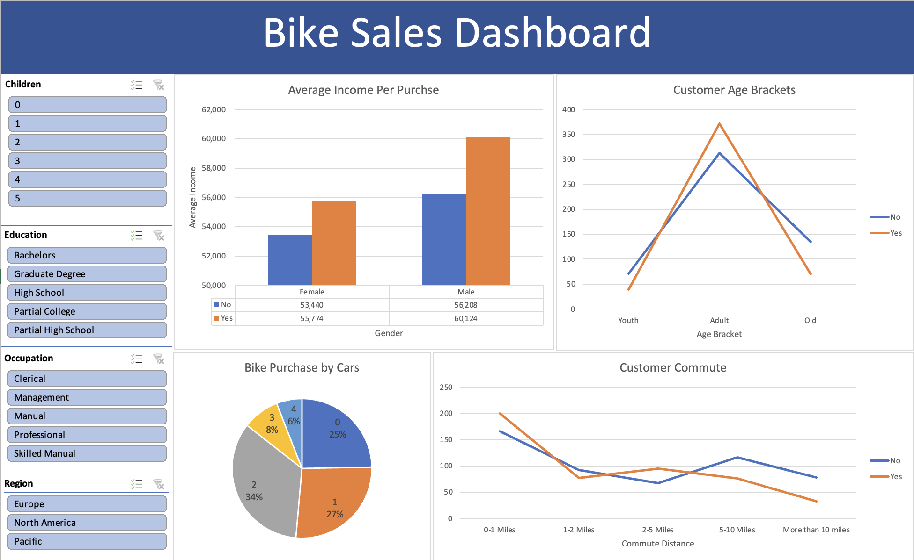
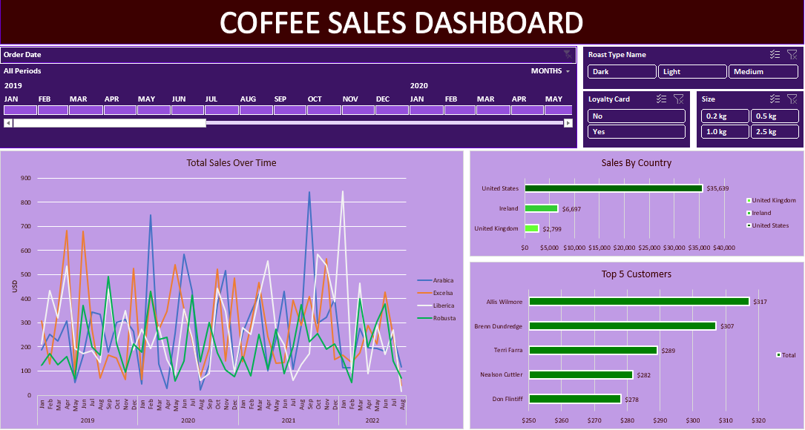
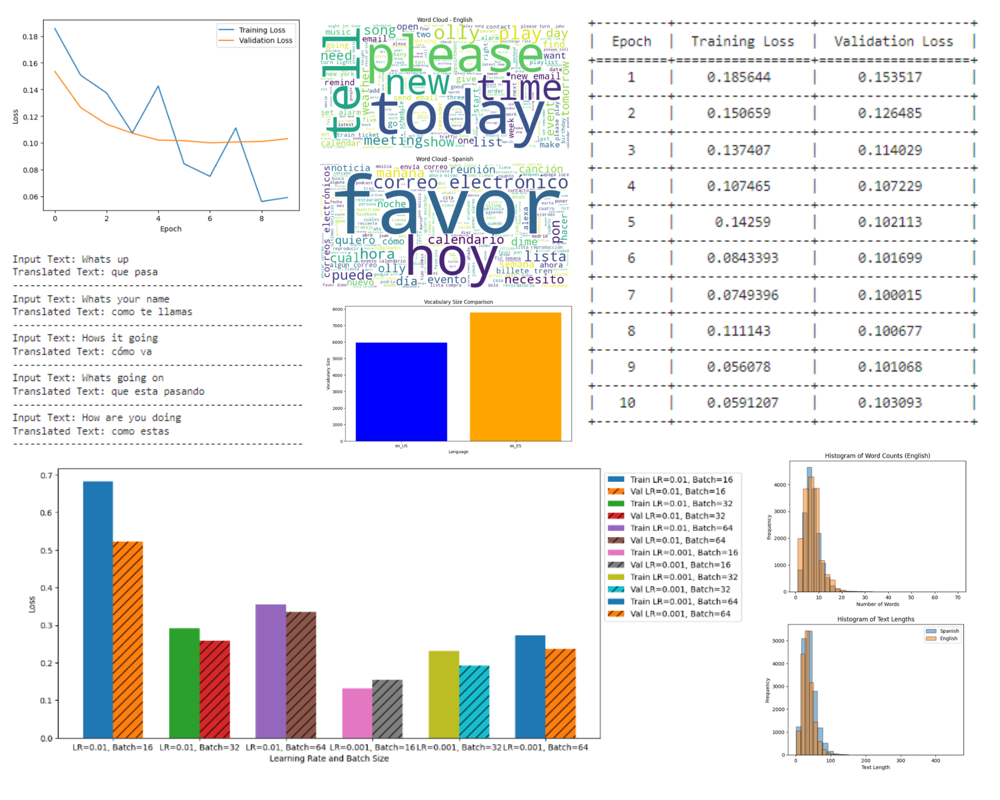

# EDUCATION
-----------------------------------------------------------------------------------------------
### Metropolitan State University of Denver || May 2024
#### B.S. Computer Science &amp; Minor in Mathematics
* Cumulative GPA: 3.59/4.0
* Community College of Aurora, Concurrent Enrollment, GPA: 4.0/4.0 — May 2021
  
## PROJECTS
-----------------------------------------------------------------------------------------------
### Bank Loan Data Analysis

* Preprocessed and formatted data for usability in data analysis. 
* Created Linked dashboards for Summary and Overview statistics.
* Generated maps, pie charts, bar charts, and line graphs for detailed visualization.

### Bike Sales Data Analysis

* Preprocessed data in excel and added categorical columns for demographic generalization.
* Utilized pivot tables to generate meaningful insights from generalized data.
* Produced a demographic-focused dashboard as it relates to bike sales with interactive slicers. 

### Coffee Sales Data Analysis

* Preprocessed and calculated data to derive insights and metrics from coffee sales.
* Created pivot tables, slicers, and timelines for interactive data analysis.
* Developed visualizations and converted data tables to clearly present sales trends.

### Machine Learning English-Spanish Translator

* Performed Data Exploration, Manipulation, and Analysis on a large, imported translation
dataset. 
* Utilized Pytorch and Hugging Face models to build a small encoder-decoder transformer.
* Created an English-to-Spanish translator using a trained model on Google Colab.

### MSU Denver Bulletin Board

* Collaborated with a team to build a live bulletin board app for university professors.
* Developed backend with Firebase and Auth0 and front end with GitHub pages.
* Utilized Trello to manage workflow, practiced agile development, and communicated via teams
and Discord.

## SKILLS
-----------------------------------------------------------------------------------------------
### Core Competencies &amp; Values
* Fast self-learner, willing to learn, leadership capable, adaptable, SDLC, agile methodologies
* Teamwork, collaboration and communication, technical documentation, integrity, sustainability

### Programming Languages &amp; Technical Software
* JavaScript, Java, C++, C#, HTML, XML, SQL, ARM, Python, R, MATLAB
* SDLC, LAN/WAN, TCP/IP, DHCP, DNS, VPN, NIST, Citrix, Mac, Windows, Linux
* GitHub, Jira, Excel, Office, Trello, Azure, Firebase, SolidWorks, AutoCAD, Autodesk

## Languages
* Spanish – Fluent; Russian – Advanced

 
## WORK EXPERIENCE
-----------------------------------------------------------------------------------------------
### King Soopers, Produce Associate || May 2023 - Jul 2024
* Stocked produce, operated machinery, adjusted stock orders, and maintained inventory
accuracy. 
* Ensured cleanliness and sanitation of produce and equipment, adhering to safety standards. 
* Greeted and assisted customers with inquiries, enhancing customer shopping experience.

### Walmart, Front-end Cashier and Stocking Associate || February 2022 - May 2023
* Utilized company standard applications to assist customers, allocate stock, and work-related
tasks.
* Operated warehouse equipment, unloaded trucks, and ensured delivery of high-ticket items.
* Constructed detailed and important displays alone and with a team.
  
### National Martial Arts Academy, Floor Instructor || August 2021 - February 2022
* Constructed lesson planners and led classes for kids, young adults, and adults.
* Enhanced student retention by innovating curriculum and engaging instructional methods. 
* Performed and attended belt tests for students and planned ceremonial presentations and lesson
scheduling.
