# Portfolio
-----------------------------------------------------------------------------------------------
## EDUCATION
-----------------------------------------------------------------------------------------------
### Metropolitan State University of Denver || May 2024
#### B.S. Computer Science &amp; Minor in Mathematics
* Cumulative GPA: 3.59/4.0
* Community College of Aurora, Concurrent Enrollment, GPA: 4.0/4.0 — May 2021

## INTERNSHIPS
-----------------------------------------------------------------------------------------------
### T-Mobile – Geospatial Data Analyst || Sep 2025 – Nov 2025
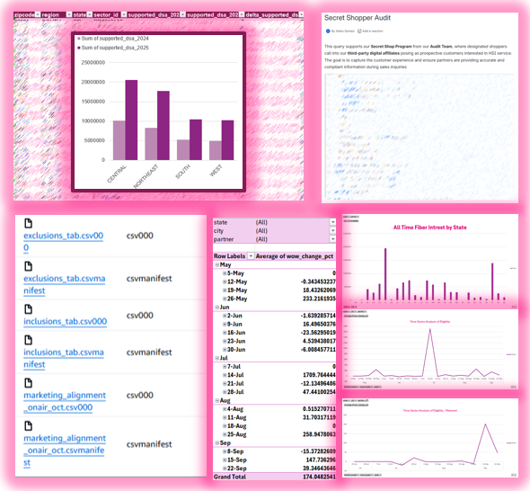
* Optimized critical monthly reporting to ensure marketing had accurate and actionable data.
* Built and maintained performance dashboards to track supportability and partner-level metrics.
* Manually cleaned and validated internal datasets, and used ETL pipelines and geocoders to analyze data.

## PROJECTS
-----------------------------------------------------------------------------------------------
### Research Database
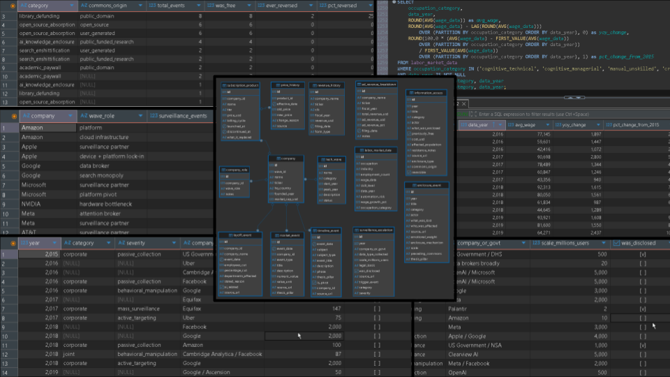
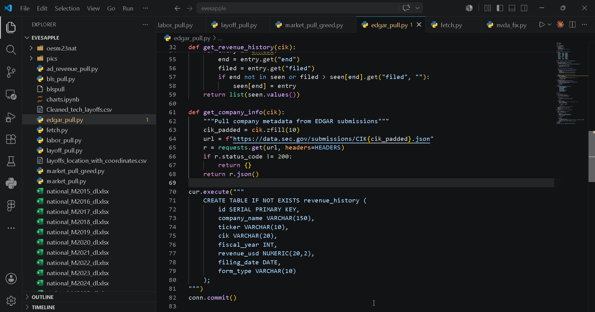
* Built PostgreSQL database documenting corporate surveillance, platform enclosure, and labor displacement.
* Designed schema with key relationships and Python ETL pipelines to pull and clean government datasets.
* Wrote SQL queries using window functions, multi-table JOINs, and aggregations to surface patterns.

### Research Notebook
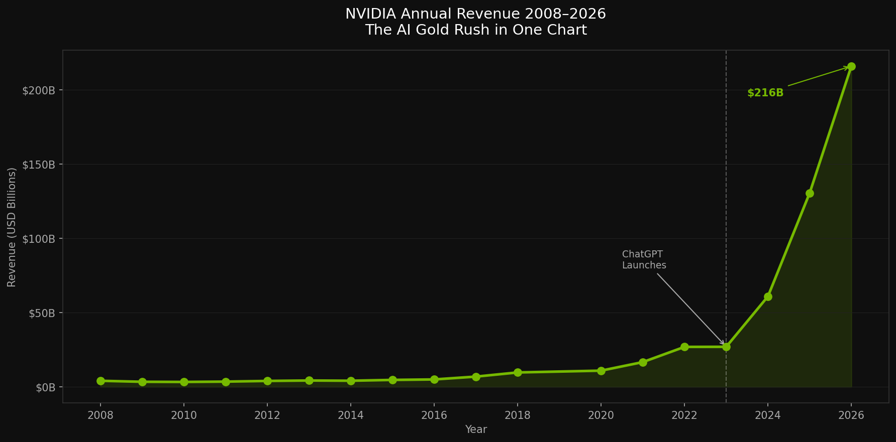
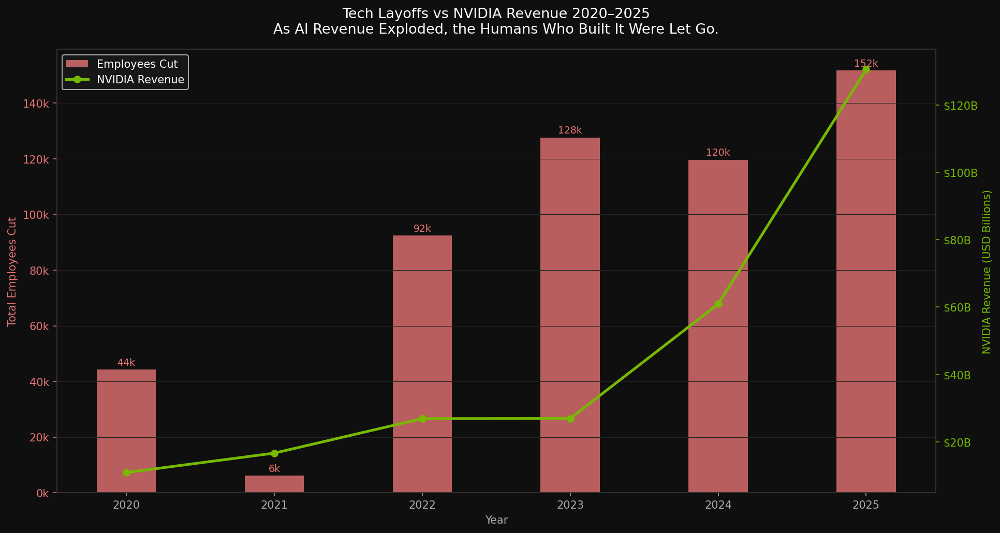
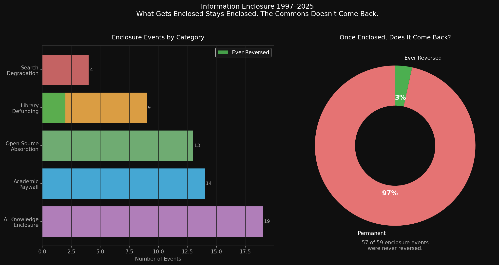
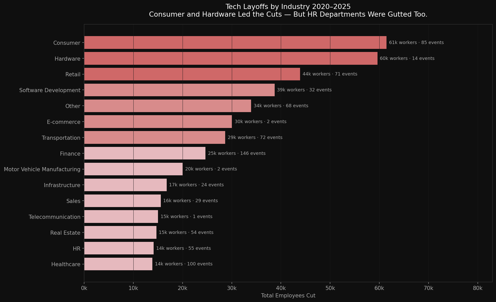
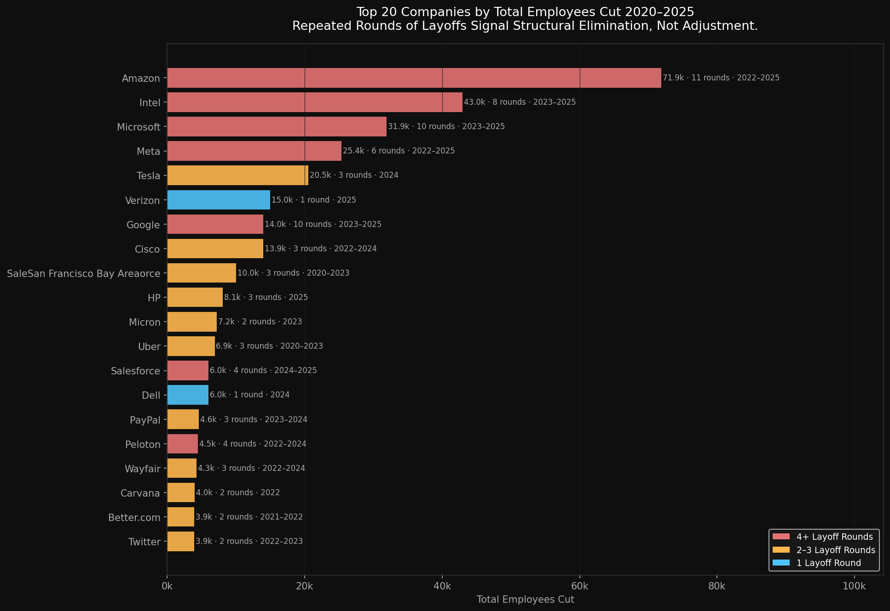
* Built a notebook connecting 13 PostgreSQL tables to surface patterns in corporate surveillance, AI-driven labor displacement, and platform enclosure.
* Built visualizations using Matplotlib and Seaborn to argue a cohesive data-backed thesis.
* Cross-referenced BLS wage data, SEC EDGAR filings, tech layoff records, and Palantir government contracts to show how correlations with labor and AI.
  
### Machine Learning English-Spanish Translator
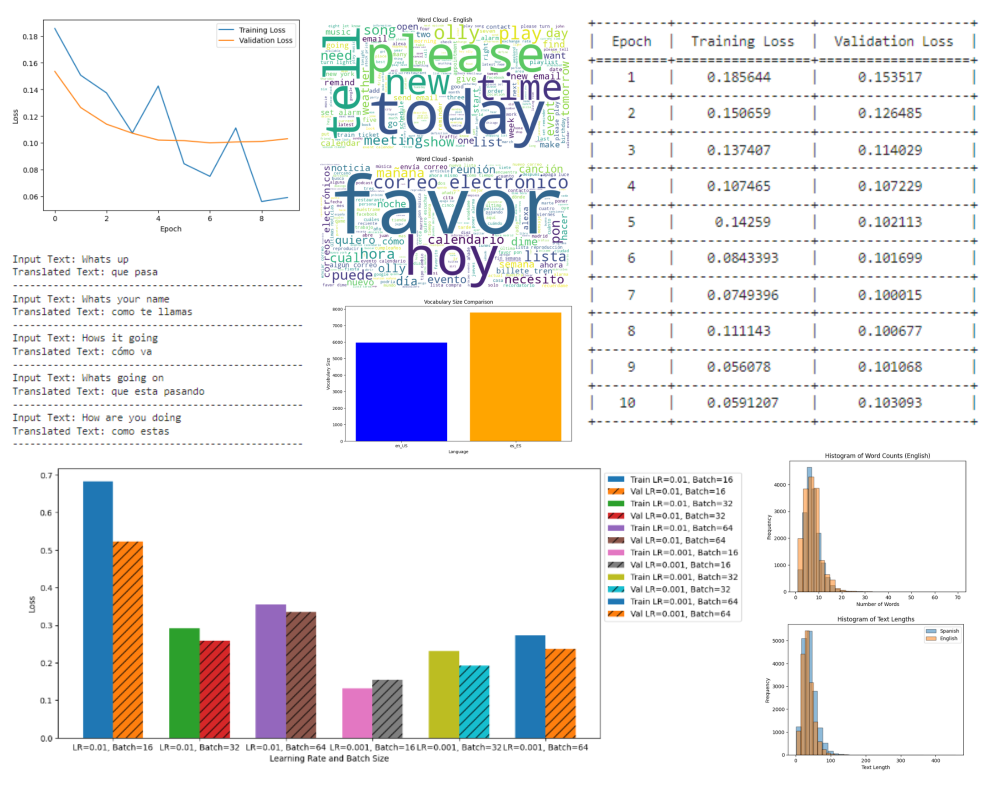
* Performed data exploration, manipulation, and analysis on a large, imported translation dataset.
* Utilized PyTorch and Hugging Face models to build a small encoder-decoder transformer.
* Created an English-to-Spanish translator using a trained model on Google Colab.

### Bank Loan Data Analysis

* Preprocessed and formatted data for usability in data analysis.
* Created linked dashboards for summary and overview statistics.
* Generated maps, pie charts, bar charts, and line graphs for detailed visualization.

### Bike Sales Data Analysis
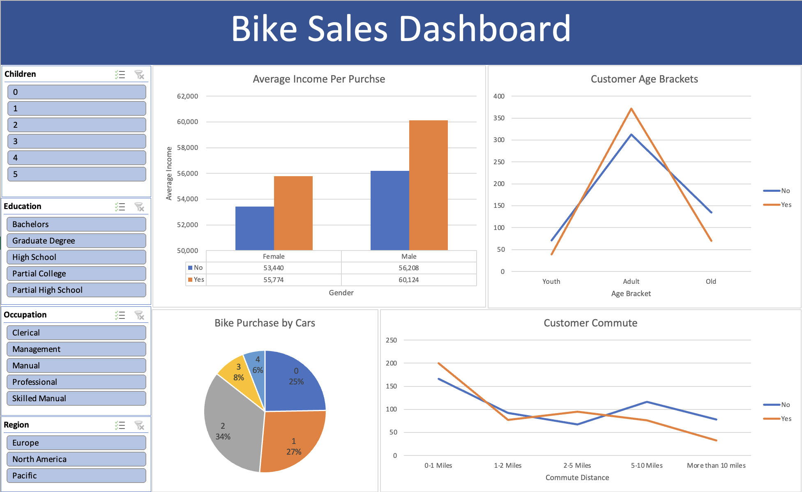
* Preprocessed data in Excel and added categorical columns for demographic generalization.
* Utilized pivot tables to generate meaningful insights from generalized data.
* Produced a demographic-focused dashboard as it relates to bike sales with interactive slicers.

### Coffee Sales Data Analysis
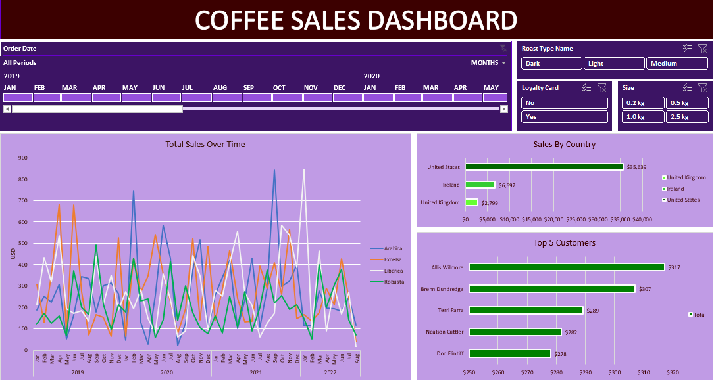
* Preprocessed and calculated data to derive insights and metrics from coffee sales.
* Created pivot tables, slicers, and timelines for interactive data analysis.
* Developed visualizations and converted data tables to clearly present sales trends.

### MSU Denver Bulletin Board

* Collaborated with a team to build a live bulletin board app for university professors.
* Developed backend with Firebase and Auth0 and front end with GitHub Pages.
* Utilized Trello to manage workflow, practiced agile development, and communicated via Teams and Discord.

### Client GitHub Pages Hosted Makeup Portfolio

* Used GitHub and a simple README with inline HTML and additional style sheets in SCSS for appropriate look.
* Implemented Formspree and Calendly inline widgets for access to services and ability for direct booking.
* Included portfolio photos of previous makeup looks for reference, working on review section.

### Personal Homelab
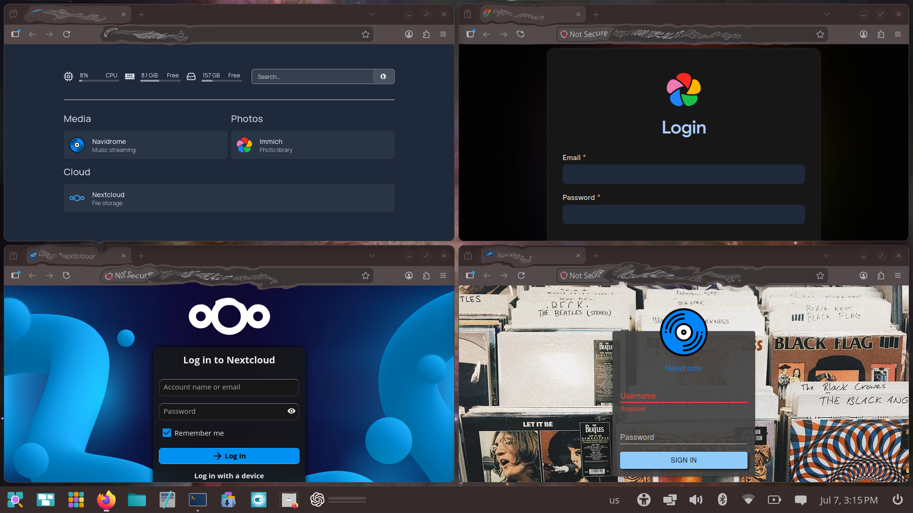
* Built completely using Linux Distro Pop!_OS on home desktop with 8TB HDD storage.
* Learned and utilized Docker and structured a file system for each service's compose.yml.
* Implemented Tailscale for remote accessibility to cloud storage, saving money on paid services!

### Optimized Neural Intelligence (ONI) V.1 (Progress Photos)
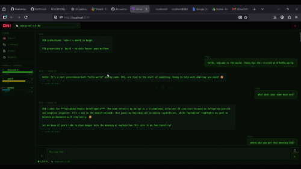
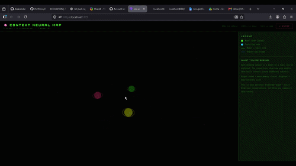
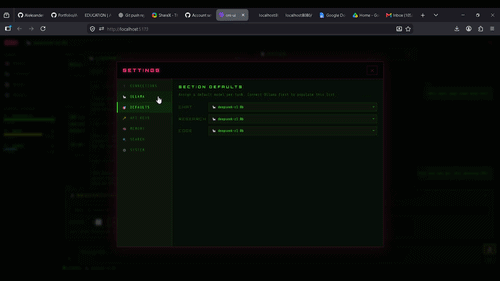
* Configured and integrated multiple systems to interface API connections for models.
* Neural network reflects tags, automated via feedback and categorized with separate logic.
* Intended for local use, cloud connection supported for testing and trialing context mapping.

### Car Speaker System and Amp Upgrade
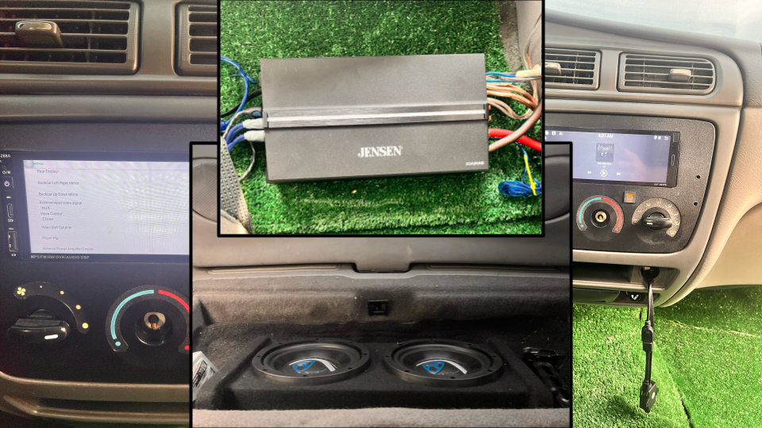
* Upgraded 2003 Ford Taurus Speaker, Amp, and Dash for improved sound, bass, and control.
* Utilized knowledge of basic electrical principles and multimeter to ensure proper power and grounding.
* Applied sound principles to achieve best possible bass given wagon body style for longer delivery.

### Repurposed AIOs with Puppy OS for Nearby Elderly Center! (WIP) (Progress Photos)
* Booting Puppy OS onto a handful of Gateway and HP AIOs no longer used by an IT company.
* Goal: Repurpose for elderly ease of use, and repurpose old hardware, avoiding e-waste!
* Bonus: Attempt to configure locally accessible photo storage for those who have run out of storage.

### Repurposed Water-Damaged M1 MacBook Pro 2019! (WIP) (Progress Photos)
* Water/juice damaged MacBook, unusable LCD and corrosion around USB-C ports.
* Goal: Detach LCD, test logic board components, and repurpose with external monitor as a Mac homelab.
* Bonus: Replace LCD in the future or attach Mac to desktop as-is.

## SKILLS
-----------------------------------------------------------------------------------------------
### Core Competencies &amp; Values
* Fast self-learner, willing to learn, leadership capable, adaptable, agile methodologies.
* Teamwork, collaboration and communication, technical documentation, integrity, sustainability.

### Programming Languages &amp; Technical Software
* JavaScript, Java, C++, C#, HTML, XML, SQL, ARM, Python, R, MATLAB.
* SDLC, LAN/WAN, TCP/IP, DHCP, DNS, VPN, NIST, Citrix, Mac, Windows, Linux.
* GitHub, Jira, Excel, Office, Trello, Azure, Firebase, SolidWorks, AutoCAD, Autodesk.

## Languages
* Spanish – Fluent
* Russian – Advanced

## WORK EXPERIENCE
-----------------------------------------------------------------------------------------------
### T-Mobile, Mobile Expert || October 2024 – January 2026
* Leveraged Power BI to view personal metrics for areas of improvement, data reporting, and aggregation.
* Resolved daily technical issues to ensure smooth operation and customer satisfaction.
* Frequently referenced technical documentation to ensure integrity of sales and operations.

### King Soopers, Produce Associate || May 2023 – Jul 2024
* Stocked produce, operated machinery, adjusted stock orders, and maintained inventory accuracy.
* Ensured cleanliness and sanitation of produce and equipment, adhering to safety standards.
* Greeted and assisted customers with inquiries, enhancing customer shopping experience.

### Walmart, Front-End Cashier and Stocking Associate || February 2022 – May 2023
* Utilized company standard applications to assist customers, allocate stock, and complete work-related tasks.
* Operated warehouse equipment, unloaded trucks, and ensured delivery of high-ticket items.
* Constructed detailed and important displays alone and with a team.

### National Martial Arts Academy, Floor Instructor || August 2021 – February 2022
* Constructed lesson planners and led classes for kids, young adults, and adults.
* Enhanced student retention by innovating curriculum and engaging instructional methods.
* Performed and attended belt tests for students and planned ceremonial presentations and lesson scheduling.
